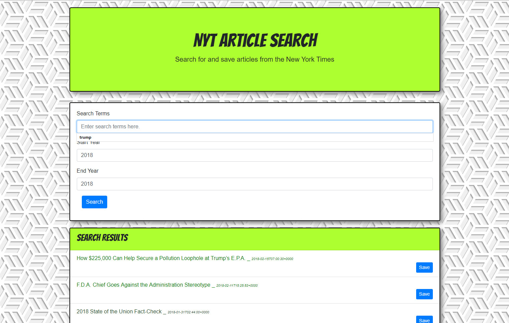

# New York Times Article Search

## Utilizing the MERN stack and the NYT article search API

### Functionality

This app allows users to run a New York Times article search, by entering search terms, starting year, and ending year. Max of 10 articles are returned. The user has the ability to save these articles for later or click on articles to view. Saved articls are displayed below the search results.

### Stack used to create app

This app utilizes the following:

* MongoDB
* Express.js
* React.js
* Node.js
* Axios
* body-parser

### Screenshot

